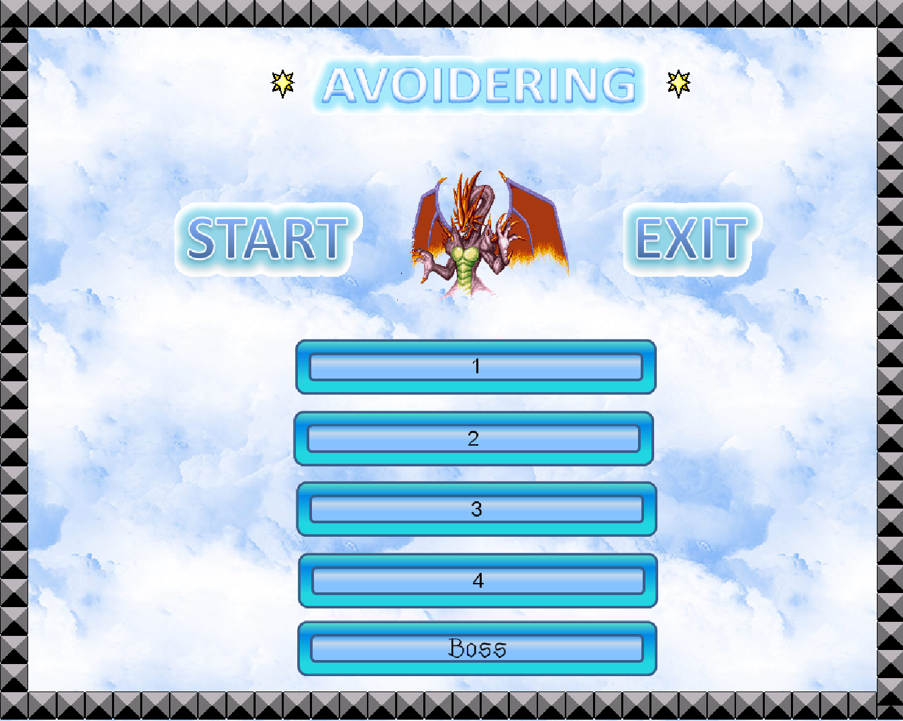
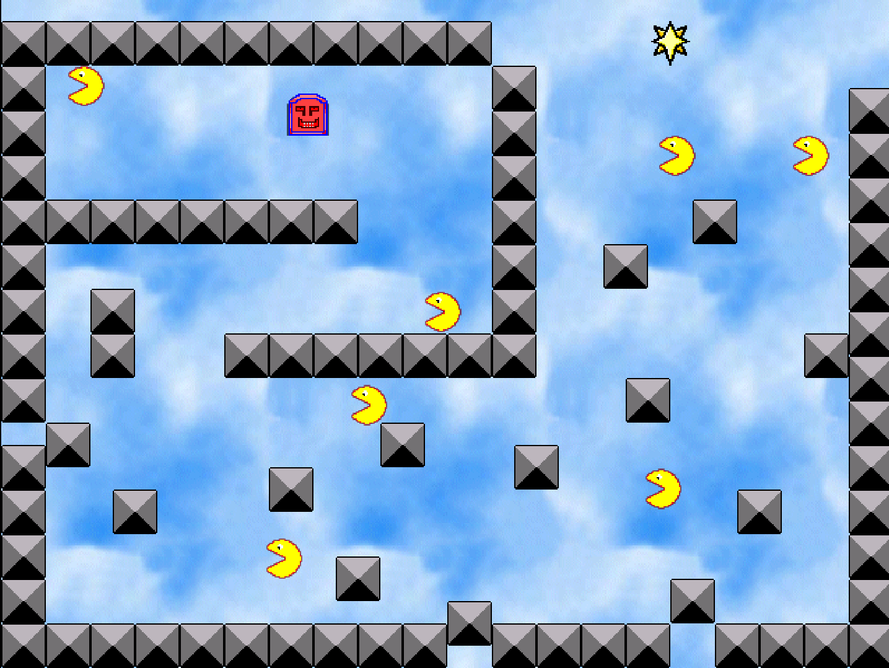
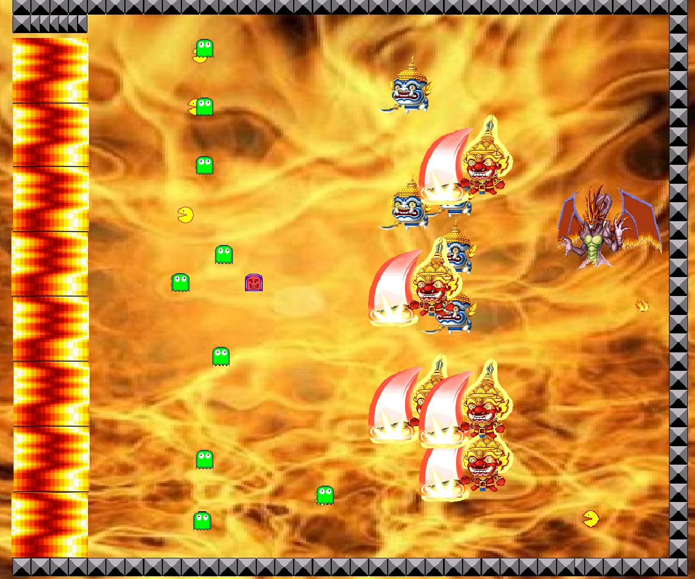
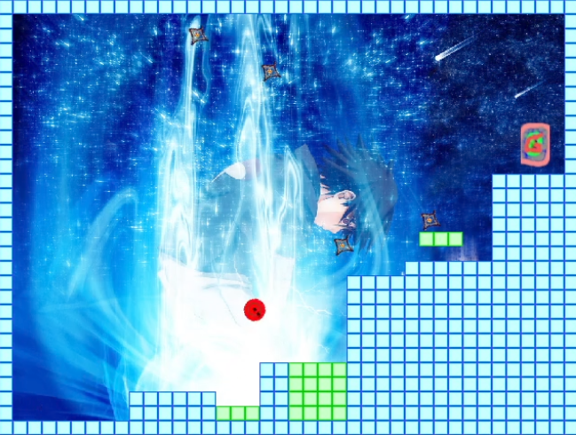
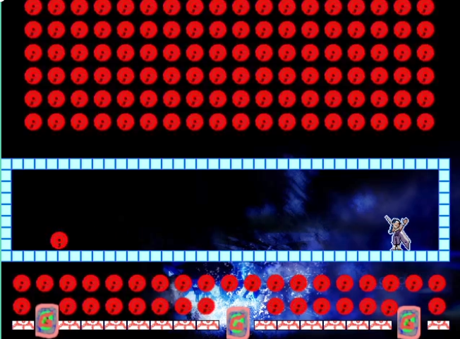
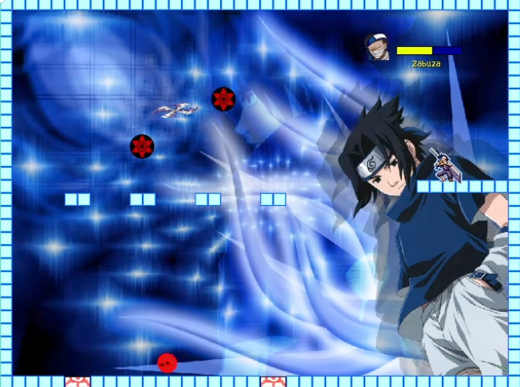
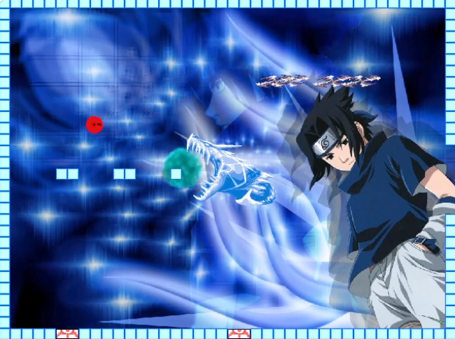

# Old game
Back in 2007, My mom bought a 14 years old me a "GameMaker" book from the Se-ed bookstore. These two game are the products of that school break.

Around the time I almost done with highschool, I uploaded these games to YOYOgame server to share it with my friend on some high school math forum.
https://www.mathcenter.net/forum/showthread.php?t=9637

Unfortunately, the yoyo game server got taken down, and the link became inactive sometime in the mid-2010s. I thought my games were lost forever, which made me sad since creating them was one of my cherished childhood memories and sparked my interest in programming.

However, 10 years later, I discovered that an unsung hero had archived every game on the YOYOgame server published before 2014.

Thank you stranger!!

https://www.yygarchive.org/game/110809

https://www.yygarchive.org/game/128496

https://www.yygarchive.org/game/189650

Download the exe file to play (Don't worry about the antivirus warning, I can promise you that I did't know how to create a virus back then) 
* **AVOIDERING_1.0.exe** (For some reason my Canon in D background music doesn't play on window 8/10/11)
* **SharinganMiniAdventure.exe**

## Avoidering

## Sharingan Adventure
SharinganMiniAdventure.exe

